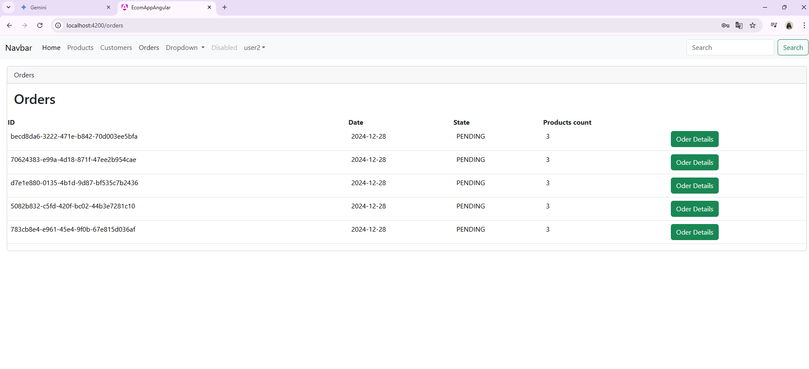

<h4>Application de gestion des commandes et produits développée avec Spring Boot. Intègre Keycloak pour l'authentification et la gestion des autorisations (JWT), OpenFeign pour les appels REST, et JPA pour la persistance des données. Sécurisée, scalable et adaptée aux environnements cloud, elle permet la création, la gestion et le suivi des commandes avec des calculs dynamiques des totaux et une liaison avec les produits.</h2>

<h5>Détails De Commande</h5>

